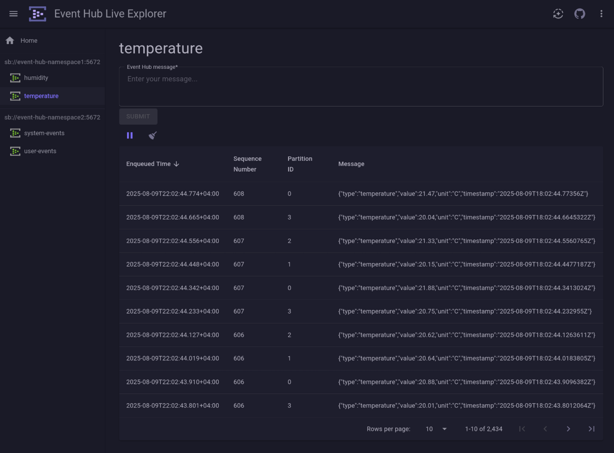

# Event Hub Live Explorer

**Event Hub Live Explorer** is a Blazor-based frontend for interacting with [Azure Event Hubs](https://learn.microsoft.com/en-us/azure/event-hubs/). It provides a streamlined interface for both **sending** and **receiving** events in real time, making it a valuable tool for local development, testing, and diagnostics.

Built with .NET Aspire in mind, it integrates smoothly into Aspire dashboards and enhances the developer experience when working with event-driven systems.

---

## ✨ Features

- 🔌 **Send messages** directly to Event Hubs
- 📥 **Read events** from multiple partitions in real time
- 🧪 Ideal for local development and testing of event-based systems
- 🛠️ Designed to easily integrate with Aspire and 

---

## 📷 Screenshot


## 🚀 Getting Started

### 🧩 Usage in Aspire

#### Prerequisites
* [.NET 9 SDK](https://dotnet.microsoft.com/en-us/download/dotnet/9.0)

Install NuGet package [LupusBytes.Aspire.Hosting.Azure.EventHubs.LiveExplorer](https://www.nuget.org/packages/LupusBytes.Aspire.Hosting.Azure.EventHubs.LiveExplorer/) in your Aspire AppHost project.

```bash
dotnet add package LupusBytes.Aspire.Hosting.Azure.EventHubs.LiveExplorer
```

#### Add **Event Hub Live Explorer** to your Aspire Dashboard
```csharp
var explorer = builder.AddEventHubLiveExplorer();
```

#### Reference an Event Hub
```csharp
var eventHub = builder
   .AddAzureEventHubs("event-hub-namespace").RunAsEmulator()
   .AddEventHub("event-hub");

explorer.WithReference(eventHub);
```

This makes the **Event Hub Live Explorer** connect to the Event Hub, using the `$Default` consumer group.

#### Use a different consumer group

```csharp
var eventHubWithCustomConsumerGroup = eventHub.AddConsumerGroup("explorer");
explorer.WithReference(eventHubWithCustomConsumerGroup)
```

#### Add all Event Hubs automatically

To reduce boilerplate, a convenience method exists to reference all Event Hubs and create consumer groups on them (if they don’t already exist):

```csharp
builder
   .AddAzureEventHubs("event-hub-namespace").RunAsEmulator()
   .AddEventHub("event-hub1")
   .AddEventHub("event-hub2")
   .AddEventHub("event-hub3")
   .AddEventHub("event-hub4");

explorer.WithAutoReferences(consumerGroupName: "explorer");
```
This will scan the application model for Azure Event Hub resources and add them as references using the provided consumer group.

>⚠️ This must be called after every desired Azure Event Hub has already been added to the application model.
Azure Event Hubs added after invocation of this method will not be referenced!
